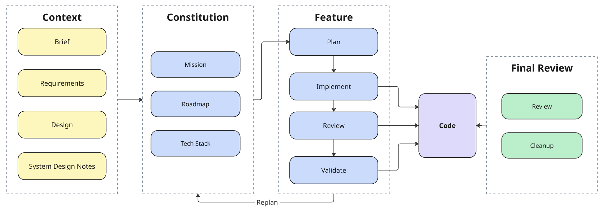

# Bin There Done That

This repo is my take home project for Precision Neuroscience. 

A cloud server streams nonnegative integers to a web client. The client bins each number into an N by N grid and paints each cell on a blue-to-red heat map in real time.


https://github.com/user-attachments/assets/acb5b48f-f38e-4488-83e2-ef69b1040f33


## Quick start

The quick start needs Git, Node.js 22, and npm. The client reads the stream from the cloud server, so you do not need to run the backend.

On macOS or Linux:

```sh
git clone https://github.com/javedgangjee/precision-take-home.git
cd precision-take-home
make client
```

`make client` installs the frontend dependencies, starts the client, and opens http://localhost:4200 in your browser. Port must be 4200.

On Windows, in PowerShell:

```
git clone https://github.com/javedgangjee/precision-take-home.git
cd precision-take-home\frontend
npm ci
$env:NG_CLI_ANALYTICS = "false"
npx ng serve --open
```

## Assumptions

- Bin index is **`(v - 1) % N²`**. The -1 seems necessary. 
- 0 goes to cell `<N-1, N-1>`.
- Default N is **32**. to match 1,024 electrodes on Layer 7. Max=100
- Each value is a **uniform random integer** from 0 to the maximum value minus 1, and the default maximum value is 10,000.
- Cloud server accepts requests only from `http://localhost:4200` and `http://127.0.0.1:4200`.
- The client runs in **Chrome** with **Energy Saver off**, and the target frame rate is **60 fps**. Energy Saver caps the frame rate at 30 fps.
- Latency numbers assume that the request and the response of `GET /time` take **about the same time** on the network

### Out of Scope 
- **Hotspot generation** - 2-3 Gaussian peaks
- **Sliding Window/Decay** - To see an up to date map
- **Admin web page** - Control settings, pause/resume


## Tech stack

- The backend is a **Python 3.13 server** built with **FastAPI**. It sends batches of random integers to the client over Server-Sent Events.
- The frontend is an **Angular 21 client** that runs on the local machine and draws the grid on an HTML canvas.
- The backend runs in a Docker image on **AWS ECS Fargate** 0.25 vCPU, behind an ALB. **AWS CDK** in Python defines infrastructure.
- The tests use pytest for the backend and the infrastructure, and Vitest for the frontend.
- A Makefile runs the common tasks, which include the local servers, the tests, the linters, and the deploy.
- Includes a local test source on frontend to test frame rate
- Includes a local docker build to test image before deploy.

The `docs/specs/tech-stack.md` file gives the version of each tool and the details of each part.

## Repo layout

- `backend/` folder holds the FastAPI server. It is a uv project.
- `frontend/` folder holds the Angular client.
- `infra/` folder holds the AWS CDK app in Python. Separate uv project.

## Results

All runs used the cloud server, which is 1 Fargate task with 0.25 vCPU. 

### Latency

Client measures each batch from generation to render, with a clock sync between the server and the client. 

**Target**: p99 of the total latency of at most 100 ms.

**Finding**: 
At 20,000 samples/s and a 50 ms batch interval, p99 of the total was **28 to 29 ms with 1 client** and **about 38 ms with 100 clients**.

### Load test

**Target**: A run passes when the p99 of the total latency is at most 100 ms and the lowest frame rate is at least 54 fps.

The first part raised the samples per second with 1 client. The second part raised the number of clients at 20,000 samples/s. Each step had 3 runs of 30 seconds. 
  - Frame rate stayed at 60 fps.
  - At **1 million samples/s with 1 client**, the p99 was **about 55 ms** and the CPU was at **82%**.
  - At **20,000 samples/s with 100 clients**, with 99 curl processes, the p99 was **about 38 ms** and the CPU was at **76 to 78%**.

CPU is the closest limit. A straight line through CPU values reaches 100% at about 1.2 million samples/s with 1 client, or at about 130 clients at 20,000 samples/s.

The `docs/results.md` file has the full tables and the limits of the measurement.


https://github.com/user-attachments/assets/d935170b-931b-4b74-9634-db7d5d56a9b1


## AI toolchain

### Tools

- **Claude Code** run in terminal in VSCode with **Opus 5.5** as the primary model
- **Claude Design** was used for the first design prototype with my custom Design System.
- **Github Copilot** inline suggestions

### Method

The project used a personal take on **spec-driven development** by JetBrains. This has been used on personal projects and given the best results. It depends heavily on the author being in charge of every decision.



The `docs/ai/ai-toolchain.md` file gives the skills and each step of the method.

## Documentation
- **Specs** - `docs/specs/` is the source of truth for what to build. The `features/` folder has one folder per feature, and each one holds `requirements.md`, `plan.md`, and `validation.md`.
- **AI usage** - `docs/ai/` shows how I used AI on the project. `ai-changes.md` records how I changed the AI output and why.
  - **Logs** - `docs/ai/logs/` holds the Claude Code session transcript for each spec-driven step, with one folder per feature.
  - **Skill** - `docs/ai/skill/` holds a copy of the custom spec-driven skill.
- **Bonus** - `docs/bonus/` holds my answers to the bonus questions. `3d.md` covers the 3D case and `server_side_rendering.md` covers server side rendering.
